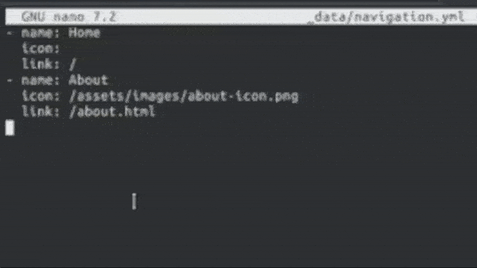

# jekyll-theme-dusk

This theme was built for GitHub Pages.

## Installation

Add this line to your Jekyll site's `Gemfile`:

```ruby
gem "jekyll-theme-dusk"
```

And add this line to your Jekyll site's `_config.yml`:

```yaml
theme: jekyll-theme-dusk
```

And then execute:

    $ bundle

Or install it yourself as:

    $ gem install jekyll-theme-dusk

## Usage

This theme has many features in it. They are written here so that it is easier to use them.

- ### Navigation Menu

To edit entries in the navigation menu, edit;
```
_data/navigation.yml
```
and add your pages, and icons if you want them.
Here is an example:
```
- name: Home
  icon: 
  link: /
- name: About
  icon: /assets/images/about-icon.png
  link: /about.html
- name: Blog
  icon: /assets/images/blog-icon.png
  link: /blog.html
```


- ### Home Page

To edit the home page, you need to include a title for the page, and a small summary.
This can be found in the front matter. Here is an example.
```
layout: home
permalink: /
title: "Dusk"
summary: "Dusk is a theme built for GitHub Pages."
```

- ### Blog Page

This page contains all your posts that you have made on your website. All you need to do is just to make some posts, and then they will all appear there.

## Contributing

Bug reports and pull requests are welcome on GitHub at https://github.com/Parmjot-Singh/jekyll-theme-dusk. This project is intended to be a safe, welcoming space for collaboration, and contributors are expected to adhere to the [Contributor Covenant](https://www.contributor-covenant.org/) code of conduct.

## License

The theme is available as open source under the terms of the [MIT License](https://opensource.org/licenses/MIT).
