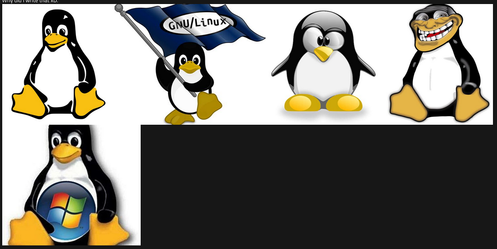

# jekyll-theme-dusk
This theme was built for GitHub Pages.

### WARNING
This theme assumes that your images are stored at
````
/assets/images
````
It's good practice to put your assets in an assets folder, in my opinion at least.

## Installation

Add this line to your Jekyll site's `Gemfile`:
```
ruby
gem "jekyll-theme-dusk"
```
And add this line to your Jekyll site's `_config.yml`:
```
yaml
theme: jekyll-theme-dusk
```
And then execute:
```
    $ bundle
```
Or install it yourself as:
```
    $ gem install jekyll-theme-dusk
```
## Usage

This theme has many features in it. They are written here so that it is easier to use them.

- ### Navigation Menu
  To edit entries in the navigation menu, edit;
  ```
  _data/navigation.yml
  ```
  and add your pages, and icons if you want them.  
  Here is an example:
  ```
  yaml
  - name: Home
    icon: 
    link: /
  - name: About
    icon: /assets/images/about-icon.png
    link: /about.html
  - name: Blog
    icon: /assets/images/blog-icon.png
    link: /blog.html
  ```
    
  Crunchy gif :)

- ### Image Galleries

  *This one is a bit complicated, but is pretty cool in my opinion.*  
  If you want to create a gallery, you will need to do a few things.
  
  **In this section, replace [GALLERY_NAME] with the name of a gallery. This must be the same for all parts if you want to use the gallery without issues.**
  
  1. Create the folders at the paths:
  ```
  /assets/images/gallery/
  
  /assets/images/gallery/[GALLERY_NAME]/
  
  /data/galleries/
  ```
  2. Place your images at ```/assets/images/gallery/[GALLERY_NAME]/(your images)```
  Replace ```(your images)``` with *your images*. What did you expect?
  
  3. Place a file at ```_data/galleries``` called ```[GALLERY_NAME].yml``` and add the names of your images according to the example below:
  ```
  yaml
  - image: tux.jpg
  - image: tux-flag.jpg
  - image: tux-old.jpg
  - image: tux-trollface.jpg
  - image: tux-unfaithful.jpg
  ```
  
  4. Place the following code into anywhere you want to add an image gallery:
  ```
  liquid
  
  ```
  
  5. Enjoy your images!
  
  
  Located at ```_posts/2023-04-21-hello-world.md```
  
  - ### Home Page

  To edit the home page, you need to include a title for the page, and a small summary.  
  This can be found in the front matter. Here is an example.
  ```
  yaml
  layout: home
  permalink: /
  title: "Dusk"
  summary: "Dusk is a theme built for GitHub Pages."
  ```
  You do not need the title or summary variables, as the variables ```{{ site.title }}``` and ```{{ site.description }}``` can be set in your ```_config.yml``` file as well, which is the default. This does override the other though.

- ### Blog Page

  This page contains all your posts that you have made on your website. All you need to do is just to make some posts, and then they will all appear there.

## Contributing

Bug reports and pull requests are welcome on GitHub at https://github.com/Parmjot-Singh/jekyll-theme-dusk. This project is intended to be a safe, welcoming space for collaboration, and contributors are expected to adhere to the [Contributor Covenant](https://www.contributor-covenant.org/) code of conduct.

## License

The theme is available as open source under the terms of the [MIT License](https://opensource.org/licenses/MIT).
